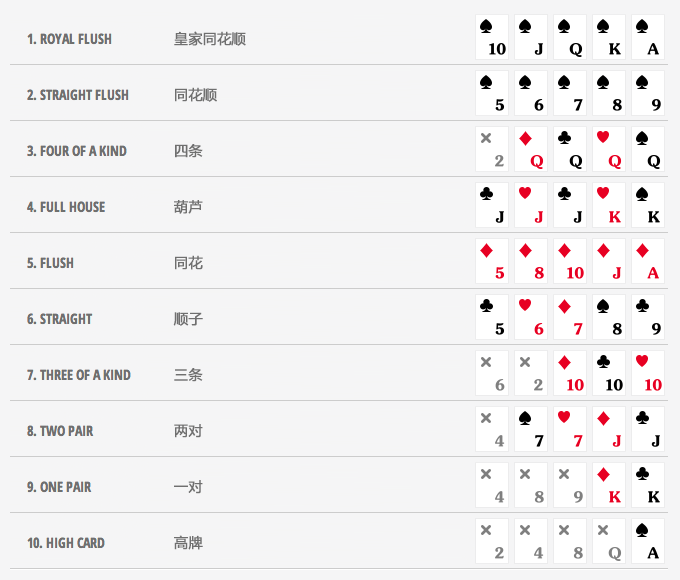

# 四段式赌徒流程教学

## 介绍

**此魔术原版流程见B站up主巴拉拉的付费教程系列，表演者是香港魔术师毛镇凯。**

B站原视频：**BV1jc411s75E** 或 **BV1Cv421C7uo**

该流程不同于以往的赌徒流程。他不仅有强大的效果，和极强的互动性，最重要的一点是——整个魔术从始至终都是观众在做选择，拥有极高的自由度。不同于原版的视频的一对一表演，我认为这个流程适合有多名观众的情况，*原因在下文有所解释*。

## 讲解

### 准备

该流程的原理很简单，部分牌是需要提前准备的。*（如下图）*

其中，**前18张牌每9张分为一组，分别是第一组（三张K、三张7、三张2），第二组（三张J，三张10，三张8）**。如果觉得准备的牌太多，我会在最后附上另一种准备的版本，他可以让你只准备前19张牌。将所有牌放在牌顶，完成准备。

### 表演部分

#### 第一轮流程及魔术原理	

表演正式开始前，可以进行适当的假洗切牌，同时简单介绍魔术。

魔术开始，表演者展示这是一副普通的牌，并表示其实自己只需要用到一部分牌，接着将前18张牌拿起（利用*切角牌*或者“桥”可以轻松做到这一点，此外，表演者也可以将牌面朝向自己找到第18张），这个过程中**不要**刻意强调牌是乱的。紧接着，表演者数出前9张牌（第一组)，将其交给观众并让他洗牌，同时，表演者背面向上打乱手中的牌，暗示观众应采用同样的方式洗牌。观众洗完牌后，让其把牌放到桌面上，将剩下的一组牌交给他，示意他洗牌。在这个过程中，我一般会简单介绍一下德州扑克的规则，虽然这个流程中一共只会出现5种牌型，但我仍然会介绍其他牌型，*这样会让观众认为有更多的情况*。德州扑克牌型大小如下：

观众洗完牌后，让观众决定哪一叠放在上面（他手上刚洗完的和桌上的）。

**这个魔术的原理十分巧妙。一组牌有9张，而每人发五张牌一共是10张，从上往下一次发牌，前九张均为一组牌，第十张属于另一组，我们的目的是让观众选到第十张牌。这样，无论前9张如何组合，我们的牌必然比观众的牌大。**

接下来的过程十分简单。让观众先发我们自己，一人五张牌，这样可以保证观众得到最后一张。接着先让观众把牌翻开，观众在前三轮可能出现一对、两对、三条三种情况，根据观众牌的大小，我们可以适当调整台词，也可以适当加入*下注*环节（看场合），例如，观众拿到三条（比较大的牌），你可以评价一句“运气不错，这是很好的牌”。此处**一定要有台词**，因为接下来我们有一个**很重要的动作**要做，它是为了为下一轮流程做准备。我们知道，观众的五张牌中，有一张是另一组的，我们需要把他和其他牌隔开。具体的方法是，观众发完牌，我们顺手接过剩下的牌，并把它放到靠近自己的地方。观众展示完他的牌之后，我们拿起剩下的那叠牌，从观众的牌中找到另一组的那张牌，并把它放回顶部。紧接着将剩余四张牌放回顶部并在四张牌下方保持一个**break**（这个break不需要特别严格，让上面四张牌脱离其他牌，保持不整齐的状态也是更便捷的选择）。

此外，再将牌放回之前，一定要跟观众确认他的牌是什么。之后，表演者展示自己的牌（它一定比观众的大），并将其放回牌顶。 至此，第一轮流程结束，此时表演者若将牌叠从break处分开，即可进入下一轮流程。

#### 后两轮流程变种

第二轮流程的表演方式会有一些变化。首先，在洗牌环节，我们可以把两组牌交给两位不同的观众去洗（如果你有第二位观众的话）。如你所见，这个魔术的核心在于两组牌不能混在一起，这也是观众经常会怀疑的地方，因此我们第一次洗牌时，自己留一份牌给观众做演示，第二次洗牌交给两位不同的观众洗牌，又是一个*绝佳的理由*。两位观众洗完牌之后，由其中一名观众决定哪一叠牌放上面，接着由他来发牌。

这一次我们又给了观众很多选择，他可以随时交换桌上的牌。但实际上他只能在前四次进行交换操作，而前四次无论观众如何交换结果*都不会改变*，我们只需要让第十张牌发给观众就可以了。如视频中演示，此轮表演应在前四轮中给予观众最大的选择权，以更大程度增强魔术的神奇。

第三轮表演方式看上去又发生了很大变化，但原理仍然是一样的。

在观众发下十张牌之后，**原来的第十张变为现在的第一张**。表演者顺手展示剩下的牌是乱的，随后将其放回牌堆底部。让观众选到第一张牌的方式很简单，就是像视频中那样，让观众伸出一根手指，然后抓住他的手腕，让他把第一张牌拖到他那边。剩下的九张牌就交给观众随意分配了，不会影响结果。最后将桌上的牌都放回牌叠底部，就可以进行下一步了。

#### 第四轮终结技

表演者直接从牌堆顶部发下十张牌，接着需要使用一种特殊的洗牌法。

**242洗牌法：**用过手洗牌的方式，一次下两张，四张，两张，注意每次洗完牌应将右手的牌叠放回去再洗下一次。

接着就是一个自动流程，按照视频里面的步骤，先让观众二选一，再让观众给自己二选一，两轮过后，再是观众三选二，再是给自己三选二，**注意每一次观众没有选择的牌要重新放回牌叠底部而不是给自己**。三轮结束之后，将会迎来整个魔术最 **nb** 的环节，表演者和观众各有四张牌，表演者展示剩下的两张牌，并让观众看了他自己的牌之后从中挑选一张。流程进行到这里，观众大概率会挑选一张牌组成葫芦，而你手上的是四张A的炸弹。你又赢了，全流程完毕。

## 一些补充

#### 假洗和强选

在该流程的某些地方可以适当增加一些*假洗假切*迷惑观众视线，或者加入一些*强选*增加随机性，具体参考表演视频。

#### 第二种准备方式

这种方法能使你只用提前准备19张牌就能表演（虽然还是很多）。

这种方法需要保留的是前18张牌，但你需要将其中一组里面的三张牌替换成三张A，然后将剩下的一张A放到后面，就像这样。

若采用这种方式进行准备，则需要额外的操作才能进入第四轮——原视频中毛老师就是用的这种方法。具体操作如下：

根据第三轮观众洗牌打乱不同，观众发完十张牌后可以分为两种情况：

1. 若观众剩下的牌是不含A的那一组，则我们在展示完剩下的牌后直接将其放回牌堆底部，并在第三轮流程结束时，按顺序将含有A的组放回牌顶。
2. 若观众剩下的牌是含有A的那一组，则我们在展示完剩下的牌（含有A）后，将其按顺序放回牌顶，并在此轮结束后，将桌面上的牌全部放回牌底。

牌序如下：

---

## 总结

相较于传统的赌博流程，该流程的内核接近于心灵魔术，他不再强调手法或是千术，而是魔术师没有做任何事情，效果却发生了。因此在表演中应当以观众为主体，尽可能引导观众做选择，创造足够的随机感。此外，该流程较长，且效果类似，表演者需要良好的引导能力，但另一方面，它能让表演者的引导能力在短时间内得到较大提升，而又不需要大象枯燥的手法练习。

